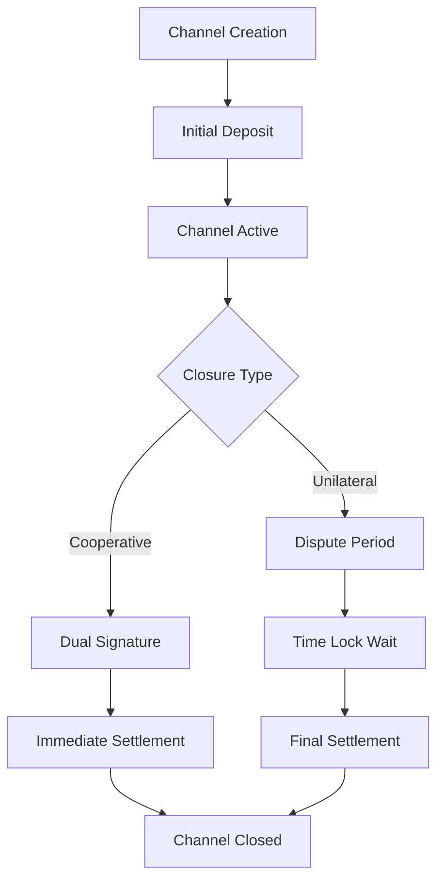
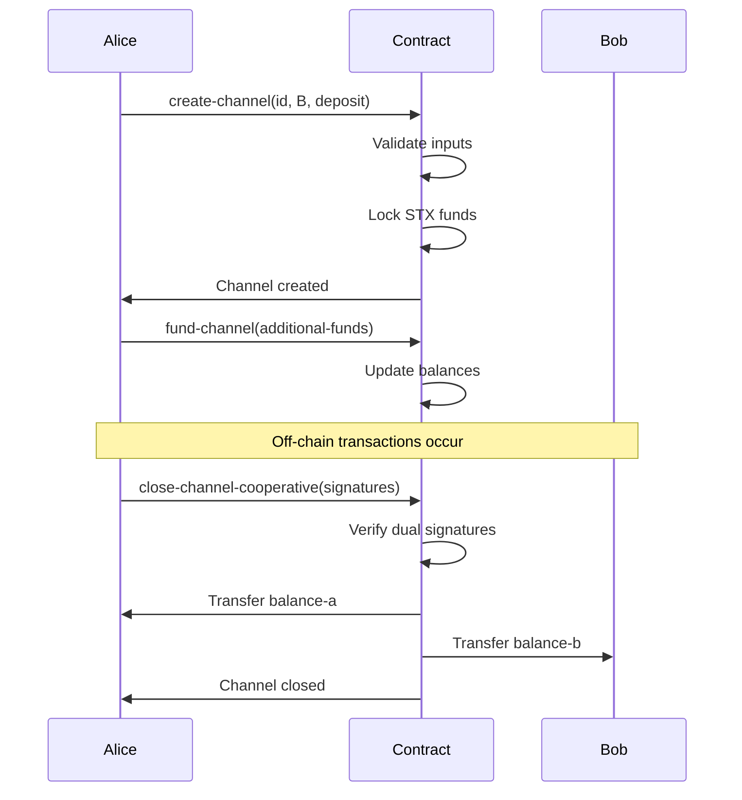

# VelocityBridge - Bitcoin-Secured Payment Channels


## Overview

VelocityBridge is a next-generation payment infrastructure that combines Bitcoin's immutable security with Stacks' programmability to enable instant, low-cost transactions. Built on Stacks Layer 2, this protocol facilitates trustless, non-custodial payment routing with atomic swaps, multi-party settlements, and cryptographic dispute resolution.

## Key Features

- **Bitcoin-anchored finality** with Stacks smart contract flexibility
- **Sub-second transaction confirmation** with cryptographic guarantees
- **Multi-hop payment routing** across interconnected channel networks
- **Penalty-based fraud prevention** with time-locked recovery mechanisms
- **Cross-chain interoperability** supporting STX/BTC atomic exchanges
- **Lightning Network compatibility** for seamless integration

## System Architecture

```
┌─────────────────────────────────────────────────────────────┐
│                    VelocityBridge Protocol                 │
├─────────────────────────────────────────────────────────────┤
│  ┌─────────────────┐  ┌─────────────────┐  ┌─────────────┐  │
│  │  Channel Mgmt   │  │ Dispute System  │  │ LN Compat   │  │
│  │                 │  │                 │  │             │  │
│  │ • Create        │  │ • Unilateral    │  │ • API Layer │  │
│  │ • Fund          │  │ • Cooperative   │  │ • Routing   │  │
│  │ • Close         │  │ • Time Locks    │  │ • Interop   │  │
│  └─────────────────┘  └─────────────────┘  └─────────────┘  │
├─────────────────────────────────────────────────────────────┤
│                   Stacks Smart Contracts                   │
├─────────────────────────────────────────────────────────────┤
│                   Bitcoin Network (L1)                     │
└─────────────────────────────────────────────────────────────┘
```

## Contract Architecture

### Core Components

#### 1. Channel State Management

- **Payment Channels Map**: Stores bilateral channel state between participants
- **Channel Validation**: Enforces Bitcoin-compatible 256-bit channel identifiers
- **Balance Tracking**: Maintains Bitcoin-style UTXO-inspired balance commitments

#### 2. Channel Operations

- **Channel Creation**: Establishes new payment channels with multisig constraints
- **Channel Funding**: Allows participants to add funds to existing channels
- **Cooperative Closure**: Enables mutual channel closure with dual signatures
- **Unilateral Closure**: Provides dispute resolution mechanism with time locks

#### 3. Security Module

- **Signature Verification**: Bitcoin ECDSA secp256k1 compatible signatures
- **Time Lock Enforcement**: Bitcoin-style nSequence/nLockTime constraints
- **Fraud Prevention**: Penalty-based system for malicious actors

### Data Structures

```clarity
;; Channel State Schema
{
  channel-id: (buff 32),        ;; BIP32-derived identifier
  participant-a: principal,     ;; Stacks address (SP)
  participant-b: principal,     ;; Counterparty address
  total-deposited: uint,        ;; Total STX escrowed
  balance-a: uint,              ;; Time-locked balance
  balance-b: uint,              ;; Revocable balance
  is-open: bool,                ;; Channel state flag
  dispute-deadline: uint,       ;; Block height timeout
  nonce: uint                   ;; BIP32 nonce derivation
}
```

## Data Flow

### 1. Channel Lifecycle



### 2. Transaction Flow



## Getting Started

### Prerequisites

- [Clarinet](https://github.com/hirosystems/clarinet) - Stacks development tool
- [Node.js](https://nodejs.org/) (v16 or higher)
- [Git](https://git-scm.com/)

### Installation

1. **Clone the repository**

   ```bash
   git clone https://github.com/savi-auto/velocity-bridge.git
   cd velocity-bridge
   ```

2. **Install dependencies**

   ```bash
   npm install
   ```

3. **Check contract syntax**

   ```bash
   clarinet check
   ```

4. **Run tests**

   ```bash
   npm test
   ```

## API Reference

### Public Functions

#### `create-channel`

Creates a new bidirectional payment channel between two participants.

```clarity
(create-channel 
  (channel-id (buff 32))
  (participant-b principal) 
  (initial-deposit uint))
```

**Parameters:**

- `channel-id`: 32-byte unique channel identifier
- `participant-b`: Counterparty's Stacks address
- `initial-deposit`: Initial STX deposit (minimum 1000 µSTX)

#### `fund-channel`

Adds additional funds to an existing open channel.

```clarity
(fund-channel 
  (channel-id (buff 32))
  (participant-b principal)
  (additional-funds uint))
```

#### `close-channel-cooperative`

Closes a channel cooperatively with both parties' signatures.

```clarity
(close-channel-cooperative
  (channel-id (buff 32))
  (participant-b principal)
  (balance-a uint)
  (balance-b uint)
  (signature-a (buff 65))
  (signature-b (buff 65)))
```

#### `initiate-unilateral-close`

Initiates unilateral channel closure with dispute period.

```clarity
(initiate-unilateral-close
  (channel-id (buff 32))
  (participant-b principal)
  (proposed-balance-a uint)
  (proposed-balance-b uint)
  (signature (buff 65)))
```

### Read-Only Functions

#### `get-channel-info`

Retrieves current channel state information.

```clarity
(get-channel-info
  (channel-id (buff 32))
  (participant-a principal)
  (participant-b principal))
```

## Security Considerations

### Time Locks

- **Dispute Period**: 144 blocks (~24 hours) for unilateral closures
- **Bitcoin Compatibility**: Uses Bitcoin block height-based timeouts
- **Grace Period**: Allows counterparty to dispute fraudulent closure attempts

### Signature Verification

- **ECDSA secp256k1**: Bitcoin-compatible signature scheme
- **Dual Signatures**: Required for cooperative channel closure
- **Message Authentication**: Prevents signature replay attacks

### Fund Security

- **Non-custodial**: Funds remain under participant control
- **Smart Contract Escrow**: Automated fund release based on conditions
- **Emergency Withdrawal**: Contract owner emergency mechanism

## Testing

The project includes comprehensive test coverage for all major functionalities:

```bash
# Run all tests
npm test

# Check contract syntax
clarinet check

# Run specific test file
npm test -- --grep "channel operations"
```

### Test Coverage

- ✅ Channel creation and validation
- ✅ Fund deposits and balance updates
- ✅ Cooperative channel closure
- ✅ Unilateral closure and dispute resolution
- ✅ Signature verification
- ✅ Error handling and edge cases

## Deployment

### Testnet Deployment

```bash
# Deploy to Stacks testnet
clarinet deploy --testnet

# Verify deployment
clarinet contract:check velocity-bridge
```

### Mainnet Deployment

```bash
# Deploy to Stacks mainnet
clarinet deploy --mainnet

# Monitor contract activity
clarinet monitor velocity-bridge
```

## Contributing

We welcome contributions to VelocityBridge! Please follow these steps:

1. Fork the repository
2. Create a feature branch (`git checkout -b feature/amazing-feature`)
3. Commit your changes (`git commit -m 'Add amazing feature'`)
4. Push to the branch (`git push origin feature/amazing-feature`)
5. Open a Pull Request

### Development Guidelines

- Follow Clarity best practices
- Add comprehensive tests for new features
- Update documentation for API changes
- Ensure all tests pass before submitting PR

## License

This project is licensed under the MIT License - see the [LICENSE](LICENSE) file for details.

## Acknowledgments

- Built on [Stacks](https://stacks.co) blockchain
- Secured by [Bitcoin](https://bitcoin.org) network
- Inspired by [Lightning Network](https://lightning.network) protocols
- Uses [Clarinet](https://github.com/hirosystems/clarinet) development framework

---

**⚡ VelocityBridge - Bridging Bitcoin's Security with Lightning-Fast Payments ⚡**
